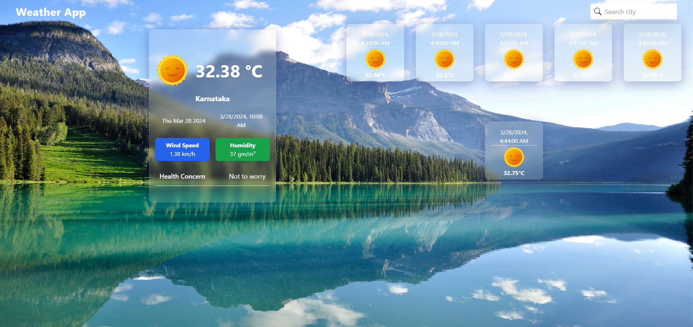

# Weather App

A weather application built with React.js, created using Create React App (CRA), and styled with Tailwind CSS. It utilizes the Tomorrow.io API for real-time weather data and the Tomorrow.io Forecast API for weather forecasts.

## Hosted Link

      [Visit the Weather App](https://health-flex-weather-app.vercel.app/)

## Tech Stack

- React.js
- Create React App (CRA)
- Tailwind CSS
- Tomorrow.io API (Real-time Weather)
- Tomorrow.io Forecast API (Weather Forecast)

## Getting Started

To run this project locally, follow these steps:

1. Clone the repository:
2. Navigate to the project directory:
3. Install dependencies:
4. Create a `config.env` file in the root directory and add your Tomorrow.io API keys:
5. Run the server using the below command:
``` npm start ```
6. Open your browser and visit [http://localhost:3000](http://localhost:3000) to view the app.

## Features

- Real-time weather data using Tomorrow.io API.
- Weather forecasts using Tomorrow.io Forecast API.
- Search functionality to get weather information for different locations.

## Additional depndencies

- You can use ```Tailwind css``` for styling based on your choice.


## API Key
   - Make sure to create your own key and replace the key in the given files
   - If you face any probles while accessing api data try to use the "predefined data" in the ```'/Utils/preData.jsx'```

## Query at

T- mail to : ``` tosifhk2000@gmail.com```


##  Snapshot




